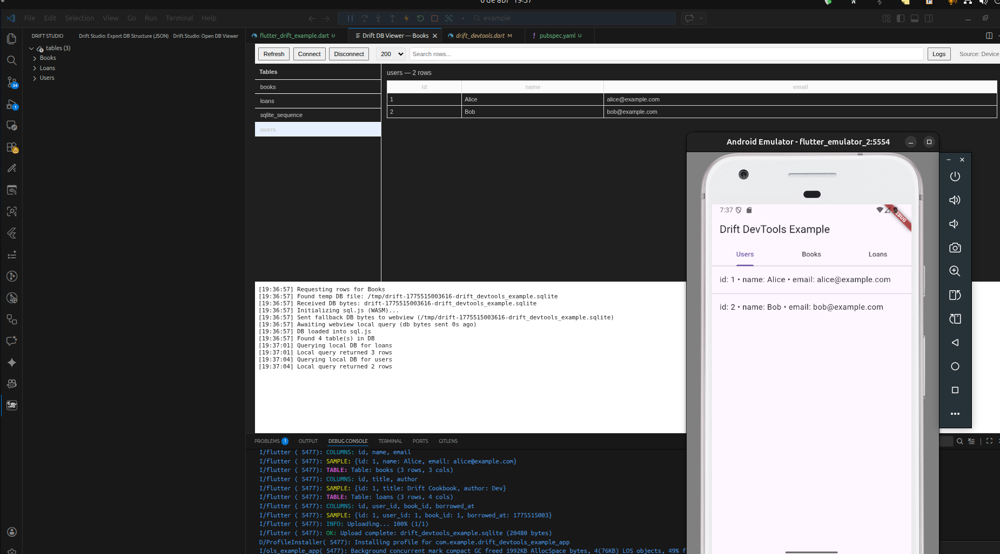

<!--
This README describes the package. If you publish this package to pub.dev,
this README's contents appear on the landing page for your package.

For information about how to write a good package README, see the guide for
[writing package pages](https://dart.dev/tools/pub/writing-package-pages).

For general information about developing packages, see the Dart guide for
[creating packages](https://dart.dev/guides/libraries/create-packages)
and the Flutter guide for
[developing packages and plugins](https://flutter.dev/to/develop-packages).
-->

# Drift DevTools (Flutter)

Uma biblioteca utilitária para facilitar a inspeção e depuração de bancos
de dados Drift (SQLite) em desenvolvimento. Fornece um exemplo simples que
gera um arquivo `.sqlite` com dados de amostra e integra-se bem com a
extensão VS Code "Drift Studio" para visualização em tempo real.



**Principais recursos**

- Exemplo mínimo de `AppDatabase` com tabelas `Users`, `Books` e `Loans`.
- Script de seed para popular um banco SQLite de exemplo.
- Arquivos gerados (`*.g.dart`) via `build_runner` já incluídos em `lib/`.
- Exemplo Flutter em `example/` que abre a DB e mostra os registros em abas.
- Compatível com a extensão VS Code Drift Studio para inspecionar o arquivo
  `.sqlite` gerado.

**Extensão recomendada**: use a extensão do VS Code Drift Studio para uma
visualização completa e interação com os arquivos gerados:

https://marketplace.visualstudio.com/items?itemName=ErickTarzia.drift-studio

## Quick start

Requisitos:

- Flutter SDK (para rodar o exemplo UI)
- Dart SDK (para executar o exemplo de console)

Gerar e executar o exemplo (Flutter):

```bash
cd drift_devtools/example
flutter pub get
flutter run
```

Executar apenas o script Dart que cria o banco (sem UI Flutter):

```bash
cd drift_devtools
dart pub get
dart run lib/flutter_drift_example.dart
```

Ao rodar o exemplo você verá que o arquivo `drift_devtools_example.sqlite`
é criado no diretório de trabalho. Abra a extensão Drift Studio no VS Code
e aponte para esse arquivo (ou use o comando da extensão para conectar),
ou simplesmente arraste/abra o arquivo no visualizador.

## Uso no desenvolvimento

Se você modificar as tabelas dentro de `lib/flutter_drift_example.dart`, gere os
arquivos com:

```bash
dart pub get
dart run build_runner build --delete-conflicting-outputs
```

Os arquivos `*.g.dart` serão gerados ao lado dos arquivos anotados (ex.:
`lib/flutter_drift_example.g.dart`). O exemplo do `example/` já depende do
pacote via `path: ..` para facilitar execução local.

## Exemplo rápido (snippet)

```dart
final db = AppDatabase();
await db.seed(); // popula com dados de exemplo
final users = await db.allUsers();
print(users);
await db.close();
```

## Contribuições

Contribuições são bem-vindas. Abra issues ou PRs com pequenos passos
reproduzíveis. Para extensões e integração com a extensão VS Code, veja o
repositório principal `drift-studio`.

## Licença

Veja o arquivo `LICENSE` na raiz do repositório.
